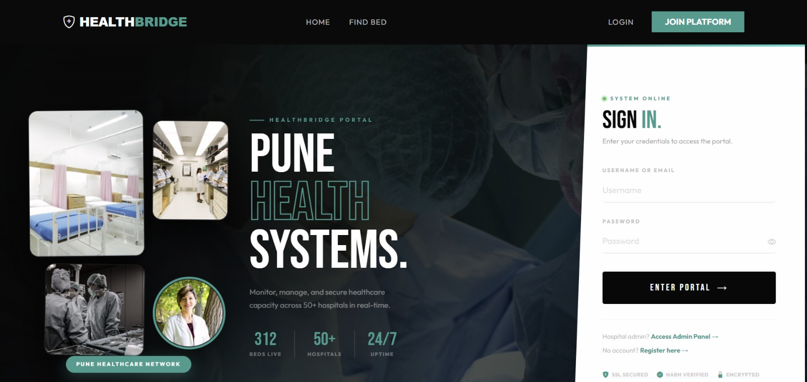
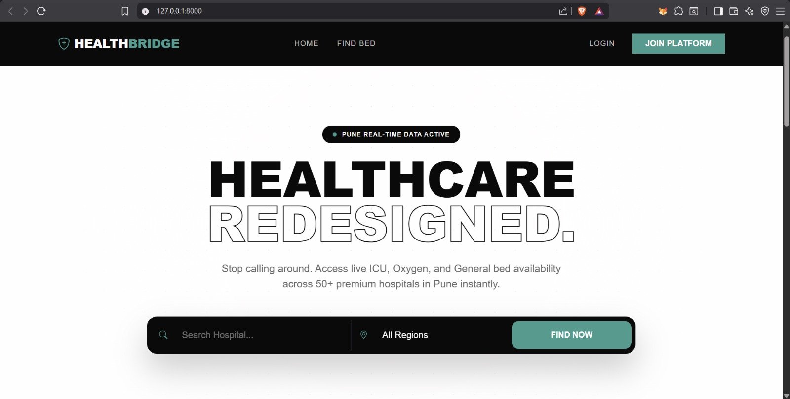
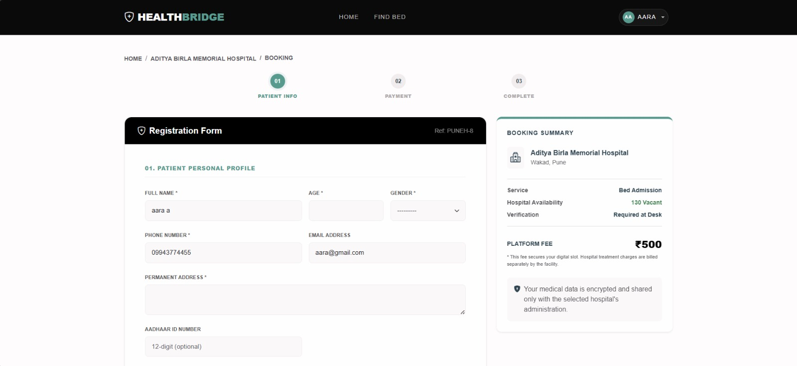
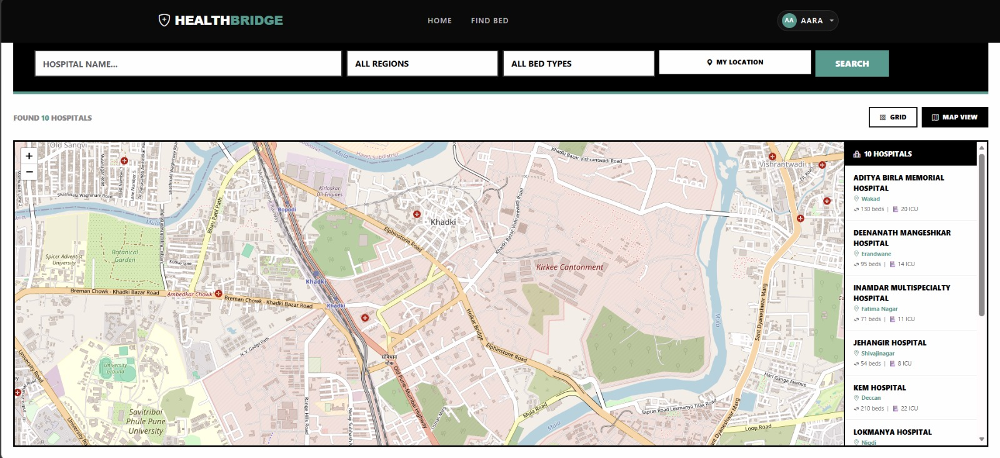
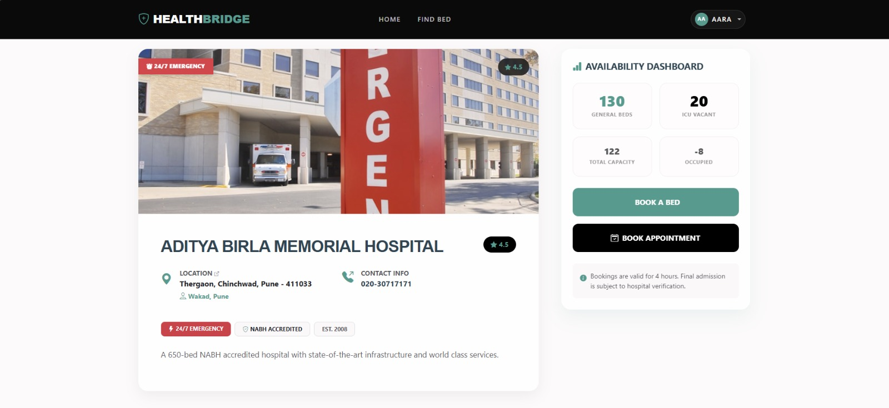
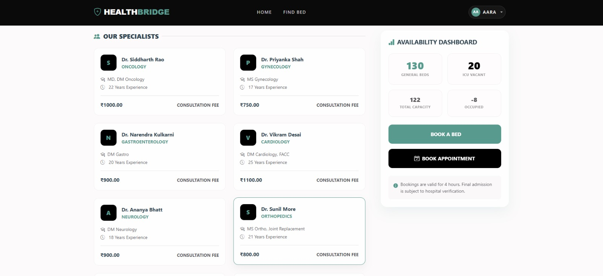
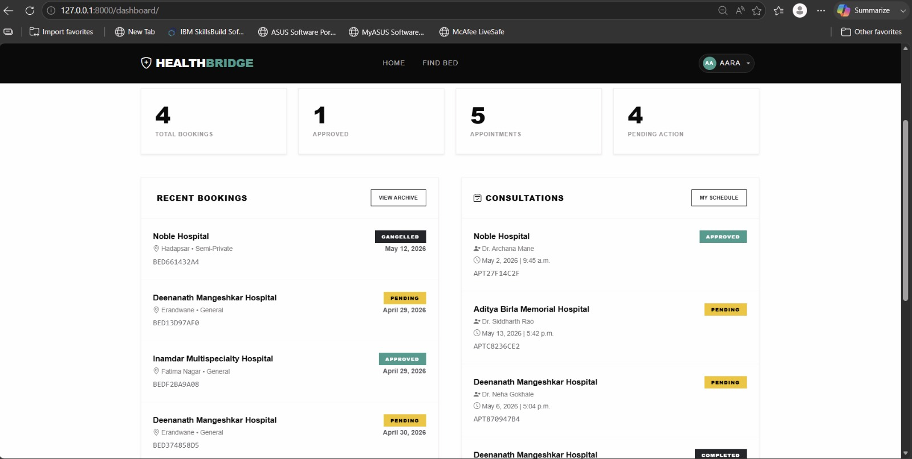
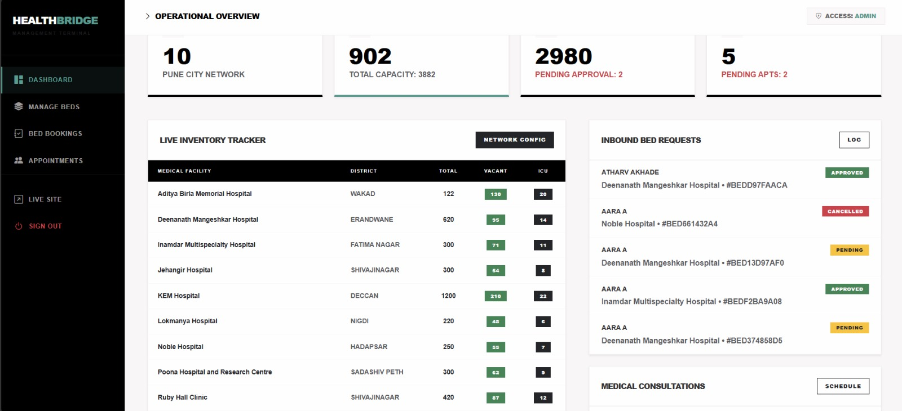
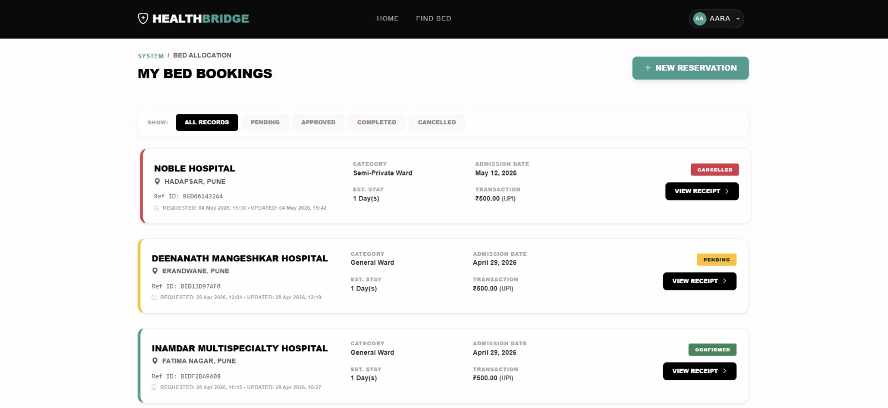

# 🏥 HealthBridge – Digital Hospital Management System
A Django-based hospital bed booking system for Pune City hospitals.

## 📖 About the Project
HealthBridge is a Django-based Digital Hospital Management System developed to simplify hospital services by providing online hospital search, bed booking, appointment scheduling, and healthcare administration through a centralized platform.

## ✨ Features
- Hospital Search
- Online Appointment Booking
- Hospital Bed Booking
- User Registration & Login
- Patient Dashboard
- Admin Dashboard
- Booking Confirmation


## 🛠 Technologies Used
- Python
- Django
- SQLite
- HTML
- CSS
- JavaScript

## ⚙ Installation

1. Clone the repository
2. Create virtual environment
3. Install requirements
pip install -r requirements.txt
4. Run server
python manage.py runserver

## 🚀 Future Enhancements
- Online Payment Gateway
- AI-based Hospital Recommendation
- Real-time Bed Availability
- Email & SMS Notifications

---

## 🚀 Setup Instructions

### 1. Create & activate virtual environment
```bash
python -m venv venv

# Windows
venv\Scripts\activate

# Mac / Linux
source venv/bin/activate
```

### 2. Install dependencies
```bash
pip install -r requirements.txt
```

### 3. Run database migrations
```bash
python manage.py makemigrations
python manage.py migrate
```

### 4. Seed Pune hospitals data
```bash
python manage.py seed_pune_hospitals
```
This will populate **10 real Pune hospitals** with departments and doctors:
- Ruby Hall Clinic (Shivajinagar)
- Jehangir Hospital (Shivajinagar)
- KEM Hospital / Sassoon (Deccan)
- Deenanath Mangeshkar Hospital
- Aditya Birla Memorial Hospital (Wakad)
- Surya Mother & Child Hospital (Baner)
- Noble Hospital (Hadapsar)
- Lokmanya Hospital (Nigdi)
- Inamdar Hospital (Fatima Nagar)
- Poona Hospital & Research Centre

### 5. Create admin superuser
```bash
python manage.py createsuperuser
```
Use this account to login at `/admin-panel/login/`

### 6. Run the development server
```bash
python manage.py runserver
```

Open: **http://127.0.0.1:8000/**

---

## 📄 URL Reference

| URL | Page |
|-----|------|
| `/` | Home / Search |
| `/search/` | Hospital Listing |
| `/search/?area=Baner` | Filter by Pune area |
| `/hospital/<id>/` | Hospital Detail |
| `/book/bed/<id>/` | Bed Booking Form |
| `/book/appointment/<id>/` | Appointment Form |
| `/payment/<type>/<id>/` | Payment Page |
| `/confirmation/<type>/<id>/` | Confirmation Page |
| `/admin-panel/login/` | Admin Login |
| `/admin-panel/dashboard/` | Admin Dashboard |
| `/admin-panel/beds/` | Manage Bed Availability |
| `/admin-panel/bookings/` | Manage Bed Bookings |
| `/admin-panel/appointments/` | Manage Appointments |
| `/django-admin/` | Django Default Admin |

---

## 📁 Project Structure

```
hospital_booking/
├── hospital_booking/       ← Django project config
│   ├── settings.py
│   ├── urls.py
│   └── wsgi.py
├── core/                   ← Main application
│   ├── models.py           ← Hospital, BedBooking, Appointment, Doctor
│   ├── views.py            ← User-facing views
│   ├── admin_views.py      ← Admin panel views
│   ├── forms.py            ← Booking & Appointment forms
│   ├── urls.py             ← All URL routes
│   └── management/
│       └── commands/
│           └── seed_pune_hospitals.py
├── templates/
│   ├── core/               ← User-facing templates
│   └── admin_panel/        ← Admin templates
├── static/
│   ├── css/style.css
│   └── js/main.js
├── media/                  ← Local image uploads
├── manage.py
└── requirements.txt
```

---

## 🗃️ Models Overview

- **Hospital** — name, area (Pune locality), address, total_beds, available_beds, icu_beds, image (local)
- **Department** — linked to Hospital (Cardiology, Neurology, etc.)
- **Doctor** — linked to Hospital & Department, with consultation fee
- **BedBooking** — patient details, medical condition, admission date, bed type, emergency contact, payment
- **Appointment** — patient, department, doctor, date/time, reason, payment

---

## ⚙️ Settings Notes

- **Image Storage**: Local (`media/hospital_photos/`) — no Cloudinary required
- **Database**: SQLite (default) — no external DB needed
- **Timezone**: Asia/Kolkata (IST)
- **Debug**: True (change to False in production)
- **Allowed Hosts**: `['*']` — restrict in production

---

## 🔐 Admin Panel

Login at `/admin-panel/login/` with your superuser credentials.

Features:
- Dashboard with live bed stats for all Pune hospitals
- Update bed/ICU availability per hospital
- Approve / Cancel bed bookings
- Approve / Cancel / Complete appointments

# 📸 Project Screenshots

## 🏠 Home Page


## 🏥 Home Interface


## 🏠 Landing Page


## 🔐 Login Page


## 📝 Registration Page


## 🔍 Hospital Search


## 🏥 Hospital Details


## 📅 Appointment Booking


## 🛏️ Bed Booking


## 👤 User Dashboard


## 🛠️ Admin Dashboard


## 📋 Booking Management

